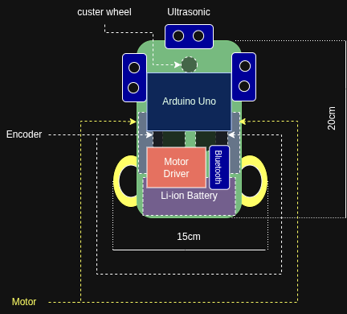
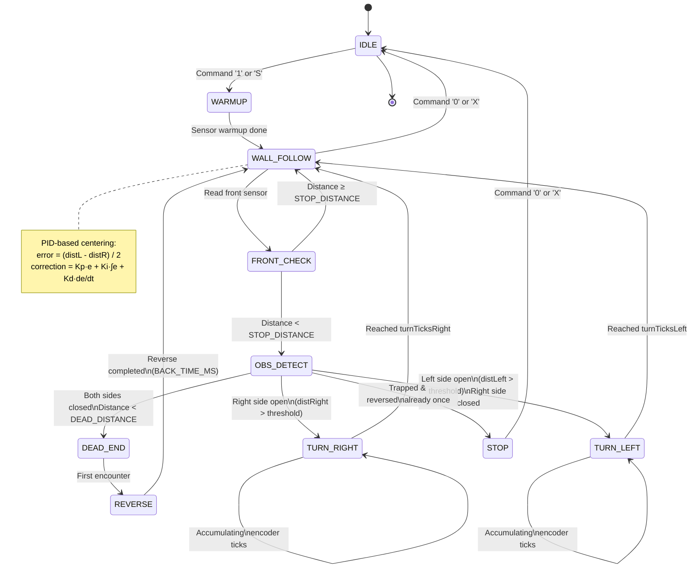

# Wall-Following Robot (ATmega328P Bare-Metal Firmware)

## Project Overview

A modular, production-grade embedded firmware for an autonomous wall-following robot based on the Arduino Uno (ATmega328P). The robot uses ultrasonic sensors to maintain a target distance from a wall while navigating around obstacles.

### Key Features
- **Dual-wall PID control**: Maintains center position between left and right walls
- **Obstacle avoidance**: Automatically detects frontal obstacles and turns accordingly
- **Dead-end handling**: Reverses when trapped in a dead-end and retries navigation
- **Encoder-based turns**: Uses wheel encoders for precise pivot turn angle measurement
- **Bluetooth control**: Accepts real-time commands over UART (HC-05 compatible)
- **Bare-metal AVR**: No Arduino high-level APIs; direct register access for minimal overhead
- **Modular architecture**: Cleanly separated concerns for maintainability and testability

---

## Mechanical Design

<p align="center">
  
</p>

The robot features a compact differential-drive configuration with:
- **Dual 200 RPM DC motors** equipped with wheel encoders for closed-loop speed and distance control
- **Three ultrasonic sensors** positioned at the front, left, and right for real-time obstacle and wall detection
- **Caster wheel** providing balance and passive support for smooth motion
- **12V battery pack** supplying power to the motor system and electronics
- **H-bridge motor driver** used to control motor direction and speed via PWM signals

---

## System Architecture

This refactored firmware divides functionality into seven independent modules:

```
wall-following-car/
├── wall_following_car.ino          ← Arduino IDE entry point
├── src/
│   ├── system/
│   │   ├── system_init.c/h         ← GPIO, interrupt initialization
│   ├── motors/
│   │   ├── motor.c/h               ← Motor control API
│   │   ├── pwm_timer.c/h           ← Timer2 PWM (Motor 1)
│   ├── sensors/
│   │   ├── ultrasonic.c/h          ← Distance measurement
│   │   ├── encoders.c/h            ← Encoder interrupts, tick counting
│   ├── control/
│   │   ├── pid.c/h                 ← PID controller (reusable)
│   │   ├── wall_follow.c/h         ← Wall centering logic
│   ├── navigation/
│   │   ├── movement.c/h            ← Forward, backward, turns
│   │   ├── obstacle_avoidance.c/h  ← Obstacle detection & avoidance
│   ├── communication/
│   │   ├── uart.c/h                ← UART driver + ring buffer
│   │   ├── command_parser.c/h      ← Serial command processing
│   ├── utils/
│   │   ├── timing.c/h              ← Timer1 microsecond counter
│   │   ├── utils.h                 ← Bit macros, constants
│   ├── robot.c/h                   ← Main robot loop (integrates all)

```

### Module Dependency Graph

```
┌─────────────────────────────────────────────────────────────────┐
│                     wall_following_car.ino                      │
│                      (Arduino IDE Entry)                        │
└──────────────────────────┬──────────────────────────────────────┘
                           │ calls robot_init() & robot_loop()
                           ▼
                      ┌─────────────┐
                      │  robot.c    │ (main coordinator)
                      └──────┬──────┘
         ┌────────────────────┼────────────────────┐
         │                    │                    │
         ▼                    ▼                    ▼
    ┌─────────────┐   ┌────────────────┐   ┌──────────────────┐
    │ system_init │   │  wall_follow   │   │ obstacle_avoid   │
    │  (GPIO)     │   │   (PID+WSM)    │   │   (FSM logic)    │
    └─────────────┘   └────────────────┘   └──────────────────┘
         │                    │                    │
         ▼                    ▼                    ▼
    ┌─────────────┐   ┌────────────────┐   ┌──────────────────┐
    │ encoders    │   │   movement     │   │   uart/commands  │
    │ ultrasonic  │   │   motors       │   │                  │
    └─────────────┘   └────────────────┘   └──────────────────┘
         │                    │                    │
         └────────┬───────────┴────────────────────┘
                  ▼
         ┌─────────────────────┐
         │  timing.c (Timer1)  │
         │  pwm_timer.c (T2)   │
         │  uart.c (USART0)    │
         └─────────────────────┘
                  │
                  ▼
         ┌─────────────────────┐
         │  Hardware (AVR)     │
         │ GPIO, Timers, UART  │
         └─────────────────────┘
```

---

## Hardware Mapping

### Microcontroller: ATmega328P (16 MHz)

| Component          | Pin   | Port.Bit  | Mode        | Purpose                    |
|--------------------|-------|-----------|-------------|----------------------------|
| **Motors**         |       |           |             |                            |
| Motor 1 Enable     | D11   | PB3/OC2A  | PWM Output  | Motor 1 speed control      |
| Motor 1 IN1        | D12   | PB4       | Digital Out | Motor 1 direction (fwd)    |
| Motor 1 IN2        | D13   | PB5       | Digital Out | Motor 1 direction (back)   |
| Motor 2 Enable     | D10   | PB2/OC1B  | PWM Output  | Motor 2 speed control      |
| Motor 2 IN1        | D9    | PB1       | Digital Out | Motor 2 direction (fwd)    |
| Motor 2 IN2        | D8    | PB0       | Digital Out | Motor 2 direction (back)   |
| **Ultrasonic**     |       |           |             |                            |
| Front TRIG         | D5    | PD5       | Digital Out | Trigger pulse (10 µs)      |
| Front ECHO         | D4    | PD4       | Digital In  | Echo pulse measurement     |
| Right TRIG         | D7    | PD7       | Digital Out | Trigger pulse (10 µs)      |
| Right ECHO         | D6    | PD6       | Digital In  | Echo pulse measurement     |
| Left TRIG          | A4    | PC0       | Digital Out | Trigger pulse (10 µs)      |
| Left ECHO          | A5    | PC1       | Digital In  | Echo pulse measurement     |
| **Encoders**       |       |           |             |                            |
| Right Encoder      | D2    | PD2/INT0  | Digital In  | Wheel tick counter (int)   |
| Left Encoder       | D3    | PD3/INT1  | Digital In  | Wheel tick counter (int)   |
| **Communication**  |       |           |             |                            |
| UART RX (HC-05)    | D0    | PD0       | Serial In   | Bluetooth command input    |
| UART TX (HC-05)    | D1    | PD1       | Serial Out  | Bluetooth feedback output  |

### Timer Configuration

| Timer  | Mode         | Prescaler | Frequency | OCR | Purpose                     |
|--------|--------------|-----------|-----------|-----|------------------------------|
| Timer1 | 8-bit PWM    | 64        | 4 kHz     | OCR1B | Motor 2 PWM + µs counter    |
|        | Fast PWM (5) |           |           |     | (OVF every 1024 µs)        |
| Timer2 | 8-bit PWM    | 64        | 4 kHz     | OCR2A | Motor 1 PWM                |
|        | Fast PWM (3) |           |           |     |                             |

### UART Configuration

```
Baud Rate:  9600
Data Bits:  8
Stop Bits:  1
Parity:     None
Flow:       None (Ring buffer RX capacity: 64 bytes)
```

---

## Finite State Machine (FSM)



---

## Control Logic

### 1. Wall Following (PID Controller)

The robot maintains a target distance (15 cm) from the centerline between two walls using a **proportional-integral-derivative (PID)** controller.

**Algorithm:**
```
error = (distLeft - distRight) / 2.0  // symmetric error
correction = Kp × error + Ki × ∫error + Kd × d(error)/dt

leftMotorSpeed  = baseSpeed × leftTrim  - correction
rightMotorSpeed = baseSpeed × rightTrim + correction
```

**Parameters (tunable via UART):**
- `Kp = 0.35`: Proportional gain (responsiveness to error)
- `Ki = 0.0`: Integral gain (steady-state error elimination)
- `Kd = 3.5`: Derivative gain (damping oscillations)
- `baseSpeed = 110`: Default PWM (0-255)

**Sensor Fusion:**
- If both sensors valid: Use symmetry error
- If only right valid: Error = (TARGET - distRight)
- If only left valid: Error = -(TARGET - distLeft)
- If both invalid: No correction (coast)

### 2. Obstacle Avoidance Logic

**Thresholds:**
- `STOP_DISTANCE = 30 cm`: Trigger avoidance check
- `DEAD_DISTANCE = 15 cm`: Dead-end detection threshold
- `*_WALL_THRESHOLD = 40 cm`: "Open" wall definition

**Decision Tree:**
```
if (distFront < STOP_DISTANCE) {
  if (distRight > RIGHT_WALL_THRESHOLD) {
    // Right is open → TURN RIGHT
  } else if (distLeft > LEFT_WALL_THRESHOLD) {
    // Right closed, left open → TURN LEFT
  } else if (distFront < DEAD_DISTANCE && !reversed) {
    // Both closed, very tight → REVERSE & RETRY
  } else {
    // Trapped → STOP
  }
}
```

### 3. Turning Strategy

**Pivot Turn (Encoder-Based):**
- **Right turn:** Left wheel drives (`TURN_SPEED_RIGHT=100 PWM`), right wheel stops
  - Continues until left wheel ticks reach `TURN_TICKS_RIGHT=27`
- **Left turn:** Right wheel drives (`TURN_SPEED_LEFT=113 PWM`), left wheel stops
  - Continues until right wheel ticks reach `TURN_TICKS_LEFT=72`

**Why Different Tick Counts?**
Due to asymmetric friction/gear ratios, left and right turns require different tick counts to achieve ~90° angles.

### 4. Reverse Strategy (Dead-End Escape)

When both sides are closed AND distance < 15 cm:
1. Reverse at `BACK_SPEED=100 PWM` for `BACK_TIME_MS=1000 ms`
2. Flag `deadReverseTrialUsed = true`
3. Resume wall following
4. If front distance > 45 cm, reset flag (allow retry if trapped again)

---

## Serial Command Interface

Commands are parsed character-by-character with 2-second inter-byte timeout (Bluetooth latency).

| Command    | Format    | Effect                                  |
|------------|-----------|------------------------------------------|
| `1` or `S` | Char      | Start wall following loop                |
| `0` or `X` | Char      | Stop & print dead-end report             |
| `R`        | Char      | Execute right pivot turn                 |
| `L`        | Char      | Execute left pivot turn                  |
| `F`        | F{seconds}| Move forward for N seconds               |
| `B`        | B{ms}     | Reverse for N milliseconds               |
| `V`        | V{speed}  | Set base speed (0-255)                   |
| `P`        | P{float}  | Set Kp (e.g., P0.35)                     |
| `D`        | D{float}  | Set Kd (e.g., D3.5)                      |
| `O`        | O{cm}     | Set front stop distance in cm            |
| `?`        | Char      | Print current settings                   |

**Example:**
```
Serial input: V120
Parsed as:    baseSpeed = 120 PWM

Serial input: P1.5
Parsed as:    Kp = 1.5
```

---

## System Flow (Main Loop)

### Initialization (`setup()`)

1. **Global interrupt disable** (`cli()`)
2. **GPIO setup** → Configure ports, directions, default states
3. **Encoder interrupts** → Enable INT0/INT1 (CHANGE mode, debounce 500 µs)
4. **Timer1 init** → Start 8-bit PWM mode, overflow counter for microseconds
5. **Timer2 init** → Start PWM for Motor 1
6. **UART init** → Enable RX interrupt, ring buffer
7. **Global interrupt enable** (`sei()`)
8. **Control structures** → Initialize PID, movement config, obstacle config
9. **Print welcome banner**

### Runtime Loop (`loop()` → `robot_loop()`)

```c
while (true) {
    // 1. Check UART for commands
    if (uart_available()) {
        cmd = uart_read_blocking();
        process_command(&robotState, cmd);
    }

    // 2. Early exit if stopped
    if (!isRunning) {
        stopMotors();
        delay(100 ms);
        continue;
    }

    // 3. Warmup sensors on first run
    if (!warmupDone) {
        for (i = 0; i < 20; i++)
            read_all_sensors();
        warmupDone = true;
    }

    // 4. Read all three distance sensors
    distFront = getDistance(&SENSOR_FRONT);
    distRight = getDistance(&SENSOR_RIGHT);
    distLeft  = getDistance(&SENSOR_LEFT);

    // 5. Update dead-end state
    if (distFront ≥ RESET_DEAD_DISTANCE)
        deadReverseTrialUsed = false;  // Reset on recovery

    // 6. Obstacle avoidance (first priority)
    if (distFront < STOP_DISTANCE)
        handle_front_obstacle(...);  // Executes turn/reverse if needed
    else {
        // 7. Wall following PID (if no obstacle)
        error = compute_PID_correction(distLeft, distRight);
        leftSpeed  = baseSpeed × trim - correction;
        rightSpeed = baseSpeed × trim + correction;
        
        // 8. Apply speeds to motors
        runMotor(1, leftSpeed, forward);
        runMotor(2, rightSpeed, forward);
    }

    // 9. Debug telemetry (optional)
    if (DEBUG) print_telemetry(...);

    // 10. Loop delay
    delay(50 ms);
}
```

**Cycle Time:** ~50 ms + sensor read time (~30-50 ms per sensor) = ~100-150 ms

---

## Compiling & Uploading

### Arduino IDE

1. Open `wall_following_car.ino`
2. Select **Board**: Arduino Uno
3. Select **Port**: /dev/ttyUSB0 (or COM3 on Windows)
4. Verify → Compile
5. Upload

### Command Line (AVR-GCC)

```bash
avr-gcc -mmcu=atmega328p -DF_CPU=16000000UL \
  -Wall -O2 -c src/utils/timing.c -o timing.o
avr-gcc -mmcu=atmega328p -DF_CPU=16000000UL \
  -Wall -O2 -c src/system/system_init.c -o system_init.o
# ... compile all .c files
avr-gcc -mmcu=atmega328p timing.o system_init.o ... -o firmware.elf
avr-objcopy -O ihex firmware.elf firmware.hex
avrdude -p atmega328p -c usbasp -e -U flash:w:firmware.hex
```

---

## Tuning Guide

### Wall Centering (PID Gains)

**Start conservative; gradually increase:**

1. **Kp only** (Ki=0, Kd=0):
   - Start at 0.1, increase to 0.5
   - Should move toward center without oscillation
   
2. **Add Kd** (damping):
   - Start at 1.0, increase to 5.0
   - Reduces overshoot and oscillation
   
3. **Add Ki** (steady-state):
   - Usually stays 0 unless offset detected
   - Risks oscillation if too large

**Test:** Place robot between two walls, monitor distance output via serial.

### Turning Parameters

**`TURN_TICKS_*`**: Tune for 90° precision
- Place robot in open area, mark starting position
- Execute `R` command, measure actual turn angle
- Adjust ticks until ~90° achieved

**`TURN_SPEED_*`**: Usually left/right asymmetry
- Left typically needs higher PWM (more friction)
- Right typically lower PWM

### Obstacle Thresholds

**`STOP_DISTANCE`**: Distance at which to check for obstacles
- Too low: Robot hits obstacles before reacting
- Too high: Unnecessary turns in open corridors
- Typical: 30 cm

**`*_WALL_THRESHOLD`**: Wall height detection
- Defines "open" for turning decisions
- Typical: 40 cm (beyond arm's length)

---

## Module Reference

### `timing.c/h`
- **ISR(TIMER1_OVF_vect)**: Free-running 1024 µs counter
- **myMicros()**: Get time in microseconds (no busy-wait)
- **myDelayMs()**: Millisecond delay (blocking)

### `uart.c/h`
- Ring buffer (64 bytes) to prevent RX overrun
- Parse integers and floats with Bluetooth latency tolerance
- Non-blocking peek for command checking

### `pid.c/h`
- Standard PID implementation
- Integral clamp: [-100, 100]
- Derivative: simple differencing (no LPF)

### `wall_follow.c/h`
- Abstraction for centering logic
- Caches old distances for graceful degradation
- Trims and speed clamping built-in

### `obstacle_avoidance.c/h`
- Dead-end state machine
- Configurable thresholds
- Turn decision logic (right > left > reverse > stop)

---

## Known Limitations & Future Work

1. **No IMU**: Relies on encoder ticks alone (no gyro correction)
2. **No velocity profile**: Constant max speed (no ramp-up/down)
3. **No path memory**: Cannot backtrack to unexplored corridors
4. **Sensor aliases**: All three distance reads sequential (not parallel)

